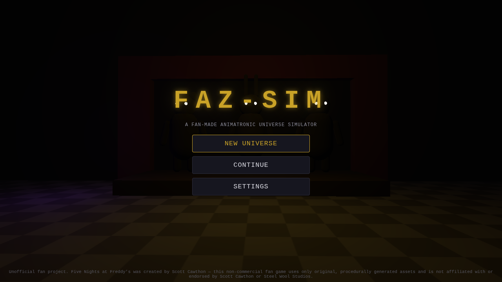
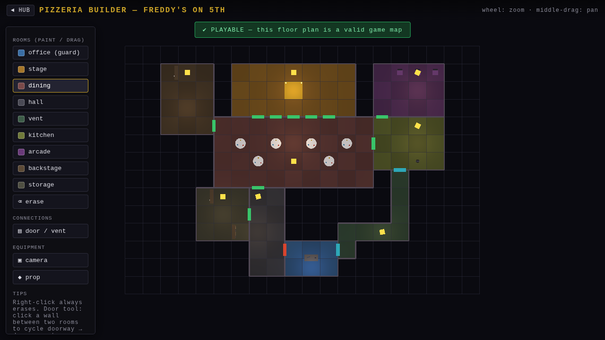
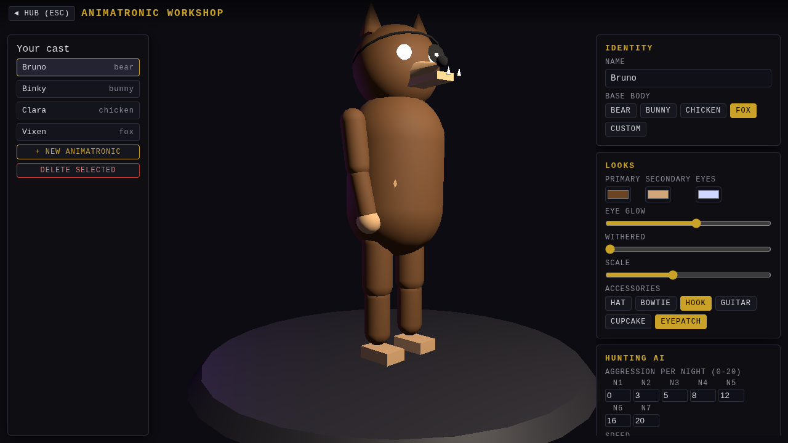
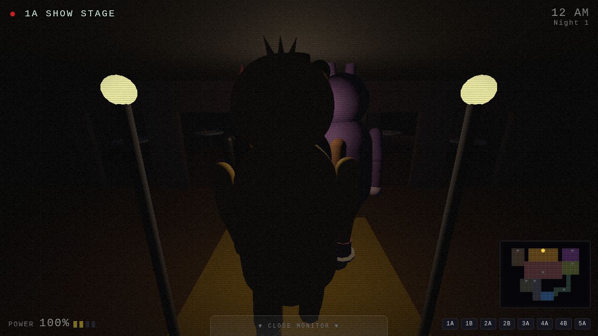
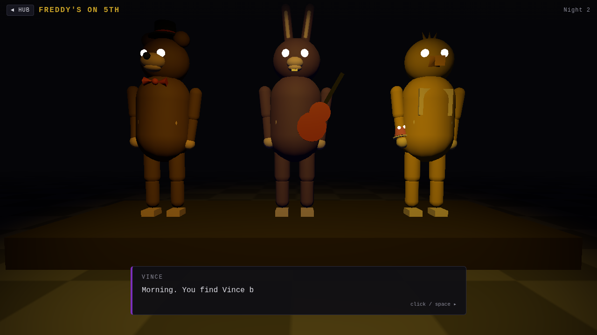
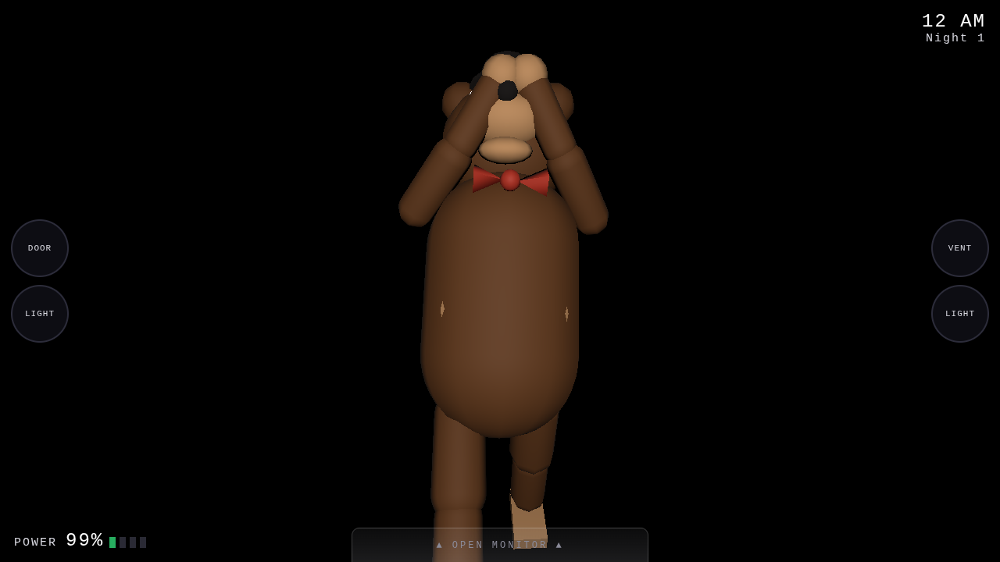
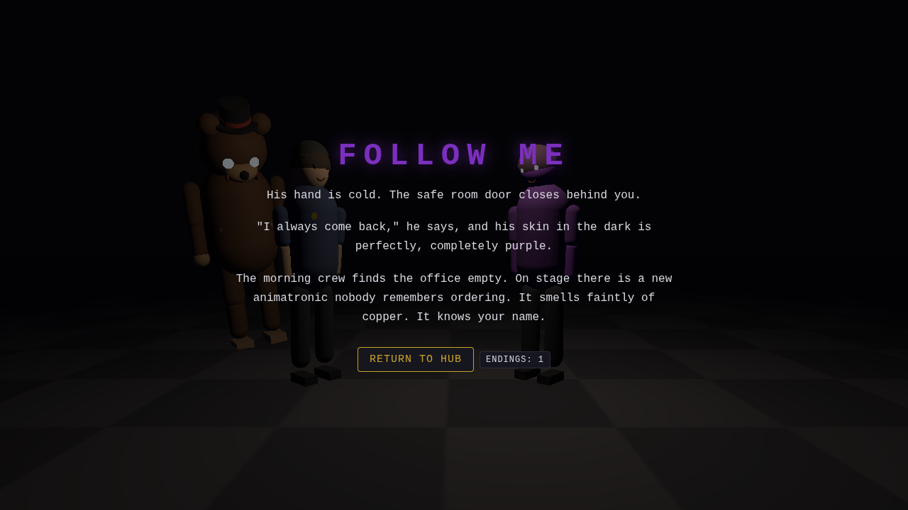

# FAZ-SIM — a fan-made animatronic universe simulator

A 3D browser game where you build your **own** FNAF-style universe — then survive it.

Design your pizzeria's floor plan, create and tune your own animatronics, customize
yourself and your best friend (keep an eye on him — he's looking a little *purple*
lately), write a branching story with multiple endings, and then play it all through
the classic night-shift survival loop: cameras, doors, dwindling power, 12 AM to 6 AM.

> **Disclaimer** — This is an unofficial, non-commercial fan project.
> *Five Nights at Freddy's* was created by **Scott Cawthon**. This game is not
> affiliated with or endorsed by Scott Cawthon or Steel Wool Studios, and uses only
> original, procedurally generated assets (all 3D models are built from primitives at
> runtime and all audio is synthesized with WebAudio — no copyrighted assets).



| Build it | Cast it | Survive it |
| --- | --- | --- |
|  |  |  |

| The story between nights | When you fail | How it ends |
| --- | --- | --- |
|  |  |  |

## Play

```bash
npm install
npm run dev        # then open http://127.0.0.1:5173
```

Production build: `npm run build` (output in `dist/`, fully static — host anywhere).

## What you can do

| Mode | What it is |
| --- | --- |
| **Pizzeria Builder** | Top-down editor: paint rooms (office, show stage, dining, halls, vents, kitchen, arcade…), connect them with doorways / doors / vents, place security cameras and props. Your floor plan **is** the game map — validation guarantees it stays playable (exactly one office with exactly two defendable entries, a stage, full connectivity). |
| **Animatronic Workshop** | Build your cast: bear / bunny / chicken / fox / custom bodies, colors, glowing eyes, hats, hooks, guitars, cupcakes, withered damage — plus their hunting AI: per-night aggression (FNAF-style d20 rolls), speed, route preference, and abilities (`ventCrawler`, `cameraJammer`, `doorRusher`). |
| **Characters** | Customize yourself and your friend. Story choices push your friend's *purpleness* — the further you follow him, the less human he renders. |
| **Story Editor** | A branching node graph: dialogue, choices (with conditions like `purpleness>=0.5` / `flag:reported` and effects like `purpleness+=0.2`), playable night nodes, and endings. A complete 5-night story with 3 endings + 1 secret ships built in. |
| **Night Shift** | First-person office: pan between your two defendable entries, flip through the cameras *you* placed (rendered live from your real 3D pizzeria), slam doors, burn power, survive to 6 AM while your own creations hunt you through the rooms you painted. |
| **Free Roam** | Walk your pizzeria in daylight and meet the band. |

Universes live in localStorage save slots and can be exported / imported as JSON —
share your pizzeria, cast and story as a single file.

## Controls

- **Everywhere** — mouse; `Esc` returns to the hub
- **Builder** — left-click paint / place, right-click erase, wheel zoom, middle-drag pan, `P` for a 3D fly-around
- **Free roam** — `WASD` move, mouse (or drag) to look
- **Night shift** — drag to pan the office; click door / light buttons; open the monitor (`Space` also flips it) to watch cameras — doors can't be used while it's up, of course

**On phones and tablets** everything runs touch-first: a virtual joystick for walking,
drag anywhere to look, tap doors/lights/cameras, one finger paints in the builder and
two fingers pinch-zoom/pan. Rendering quality defaults to `low` on touch devices
(changeable in Settings).

## Tech

Three.js + Vite, plain ES modules, zero runtime asset downloads. Rooms are derived
from the painted grid by flood fill; doors become graph edges; animatronic AI walks
that graph with seeded, reproducible RNG. All sound is synthesized (the jumpscare
scream is three detuned sawtooths through a waveshaper — you're welcome).

Verification: `node scripts/verify.mjs` drives the whole game headlessly with
Playwright (menus → builder edits → seeded nights → jumpscares → endings) and
screenshots every mode.
